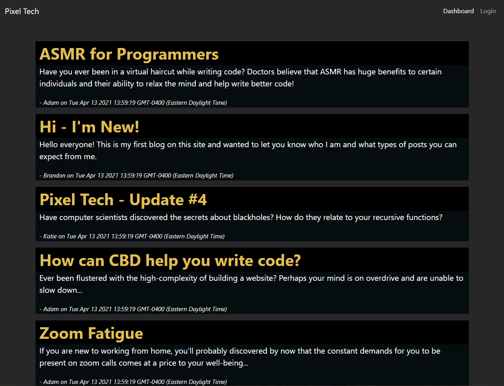
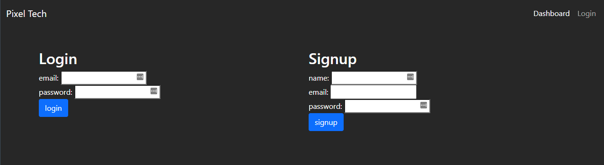
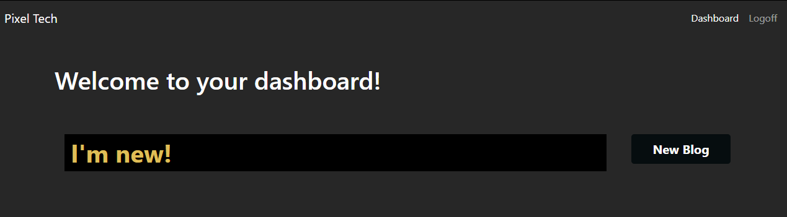
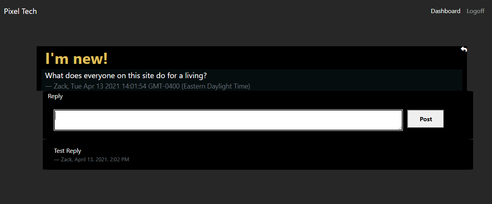

# Pixel Blog

## General 📖
---    
- Github:    https://github.com/Kyle7286/pixel-blog
- Deployed Site: https://pacific-escarpment-52809.herokuapp.com/
- Video: https://drive.google.com/file/d/1XIB2_lGKQNMoO6E388CSg-IxlrlP1Hsu/view

## About/Purpose ❔
---
Pixel Blog is a simple website which allows you to create, read and edit blog posts.

## How to Use
---
1. Navigate to website
2. Signup / Login
3. Click on a blog to read it
4. Go to dashboard to see your blogs
5. Click New Blog to create a new blog

## Technology Used
---
* mySQL
* Sequelize.js
* Boostrap 5
* Express.js
* Node.js
* Session.js
* Handlebars.js
* JQuery
* Heroku
    

## Screenshot(s) 📊
---

## Thank you 👍 
---
Thank you for your time checking out our website! It means a lot  :)